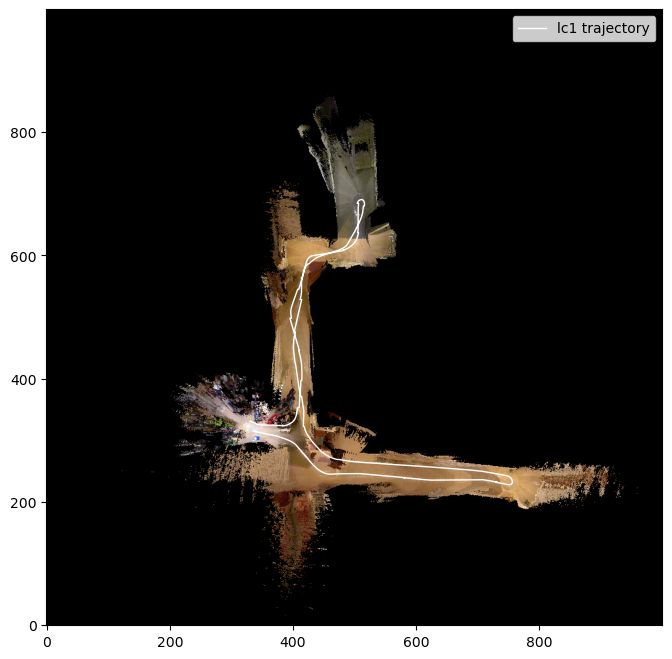

# Publications

Zhan, W., Yang, X., Lu, G., Deng, Y., & Yang, L. (2022). [A rapid quality grade discrimination method for Gastrodia elata powder using ATR-FTIR and Chemometrics](https://doi.org/10.1016/j.saa.2021.120189). Spectrochimica Acta Part A: Molecular and Biomolecular Spectroscopy, 264, 120189.
[ [pdf](assets/papers/A%20rapid%20quality%20grade%20discrimination%20method%20for%20Gastrodia%20elata%20powderusing%20ATR-FTIR%20and%20chemometrics.pdf) ]

# Work Experiences

**Jr. Applied Scientist** @ **Amazon**
06/2024-Now

&nbsp;&nbsp;&nbsp;&nbsp;&nbsp;&nbsp;Tech Stack: NLP, LLM, Reinforcement learning, Autoregressive models

&nbsp;&nbsp;&nbsp;&nbsp;&nbsp;&nbsp;Built risk models for book publishing service, developed queue optimization methods for manual review process.

**Software Engineer** @ **Beijing YeeZTechnology Co., Ltd** 
06/2023-08/2023

&nbsp;&nbsp;&nbsp;&nbsp;&nbsp;&nbsp;Tech Stack: Intel SGX, AMD SEV, RISC-V KeyStone, ARM TrustZone, CUDA

&nbsp;&nbsp;&nbsp;&nbsp;&nbsp;&nbsp;Researched Trusted Execution Environment technology and application, worked on a project which brings GPU into TEE Trust Base. [ [code](https://github.com/weixiao-zhan/understanding-hpda-code) ]

**Blockchain Engineer** @ **Beijing YeeZTechnology Co., Ltd** 
04/2021-07/2021

&nbsp;&nbsp;&nbsp;&nbsp;&nbsp;&nbsp;Tech Stack: EVM, Solidity, Vyper, Web3py

&nbsp;&nbsp;&nbsp;&nbsp;&nbsp;&nbsp;Inspected some popular De-Fi protocols’ public code and reconstructed their underlying math models. Developed smart contracts for [Earning.Farm](https://earning.farm/), achieved 9% APY on $10 million worthed tokens.

**Research Assistant** @ **FICO (China) Co., Ltd**
01/2021-02/2021

&nbsp;&nbsp;&nbsp;&nbsp;&nbsp;&nbsp;Tech Stack: SQL, SVM, Scorecard

&nbsp;&nbsp;&nbsp;&nbsp;&nbsp;&nbsp;Applied FICO’s score-card alike model to evaluate companies’ finical standing.

**Research Assistant** @ **National Agricultural and Rural Big Data Center-Yunnan Branch**
02/2019-03/2019

&nbsp;&nbsp;&nbsp;&nbsp;&nbsp;&nbsp;Tech Stack: ATR -FTIR, SVM, BP neural network

&nbsp;&nbsp;&nbsp;&nbsp;&nbsp;&nbsp;Participated in research and published “A rapid quality grade discrimination method for Gastrodia elata powder using ATR -FTIR and chemometrics.”

# Projects

## <math xmlns="http://www.w3.org/1998/Math/MathML"><mo>⊛</mo></math> Current:

**Automata Learning and Task Planning from Videos**

Learning long-horizon task specifications and representations. 
Explored optimization-based planning on differentiable sequence models.

**LLM Planning**

Implementing RAG-guided scene-graph-based LLM planning on an actual robot.

## <math xmlns="http://www.w3.org/1998/Math/MathML"><mo>⊛</mo></math> Past:

**Safe Trajectory Tracing**

P-controller vs receding-horizon certainty equivalent control (CEC) vs generalized policy iteration (GPI)
[
 [report](assets/reports/STT/Safe%20Trajectory%20Tracking.pdf) |
 [code](https://github.com/weixiao-zhan/ECE276B_PR3)
]

|  |  |  |

**Planning: A* vs PRM vs RRT vs RRT***

[
 [report](assets/reports/Planning/Planning.pdf) |
 [code](https://github.com/weixiao-zhan/ECE276B_PR2)
]

|  |  |  |  |

**Optimum Policy DP Solver for Door Key Game**

[
 [report](assets/reports/DoorKey/DoorKey.pdf) |
 [code](https://github.com/weixiao-zhan/ECE276B_PR1)
]

|  |  |  |

**Scalable ODE Solver**

A scalable (multi-process & multi-node) ODE solver using MPI library

[
 [report](assets/reports/SODES/report.pdf) |
 [code](https://github.com/weixiao-zhan/CSE260_parallel/tree/main/pa3)
]

|  |  |  |

**Accelerated General Matrix Multiplication (GeMM)**

CPU acceleration: 5 loop GoTo routine + SIMD
[
 [report](assets/reports/GEMM/report_cpu.pdf) |
 [code](https://github.com/weixiao-zhan/CSE260_parallel/tree/main/pa1)
]

GPU acceleration: CUDA hierarchy partition + interleaving + IO pipeline
[
 [report](assets/reports/GEMM/report_gpu.pdf) |
 [code](https://github.com/weixiao-zhan/CSE260_parallel/tree/main/pa2)
]
 
|  |  |  |  |

**SLAM - EFK**

EKF with dynamically composed state.
[
 [report](assets/reports/SLAM-EKF/SLAM-EKF.pdf) |
 [code](https://github.com/weixiao-zhan/ECE276A_PR3)
]

|  |  |  |

**SLAM - Factor Graph**

Iterative closest points (ICP) and factor graph optimization.
[
 [report](assets/reports/SLAM-FG/SLAM-FactorGraph.pdf) |
 [code](https://github.com/weixiao-zhan/ECE276A_PR2)
]

|  |  |  |

**Panoramic Image Generation with IMU and Camera**

Using rotation velocity, angular velocity, and gravity acceleration to reconstruct the movement of camera.
3D FOV projection is used.
[
 [report](assets/reports/PIG/Panoramic%20Image%20Generatio.pdf) |
 [code](https://github.com/weixiao-zhan/ECE276A_PR1)
]

|  |  |

**Binary Analysis Tools Comparison**
05/2022-05/2023

Comparing binary analysis tools on how they analyze and reconstruct control flow graphs. Participated in and contributed to [Dyninst](https://github.com/dyninst/dyninst) development.

**Memory Allocation Measurement**
10/2022-12/2022

Comparing the performance of a couple of recently proposed memory allocation algorithms, using “record trace and reply” approach borrowed from The Scalable Commutativity Rule (Clements et al., 2015). [ [code](https://github.com/evanwire/MemoryManagementSim) ]

**Minim Compiler**
09/2022-12/2022

Implemented a compiler translating Minim language (C-like grammar) to MIPS instructions using JLex and JavaCup.

**Enhanced Features on RoolieDB**
09/2020-12/2020

Implemented B+ tree index, system R query optimization, multi-granularity lock, and ARIES recovery.

**Enhanced Features on PintOS**
05/2020-08/2020

Implemented  process  forking,  better  virtual  memory  management  (demand  paging), priority scheduler (support semaphore, lock, and conditional variable), and a modified FFS file system (buffer cache).

**RISC -V 32-bit2 State Processor Design**
04/2020-05/2020

Designed a RISC-V 32-bit 2-state CPU from scratch using Logisim Evolution.

**Matrix Arithmetic Python Library**
01/2020-03/2020

Using python-c interface,  SIMD (AVX), and multi-threading (OMP) with carefully designed C  code, scored ~80x in a matrix arithmetic benchmark test compared to a naively implemented python library.

# Education

**University of California, San Diego**
* 09/2023-NOW
* Master of Science, major in Computer Science
* GPA: 3.8/4.0 [[transcript](assets/transcripts/transcript_ucsd.pdf)]
* Core courses: Sensing & Estimation in Robotics, Planning & Learning in Robotics, Unsupervised Learning.

**University of Wisconsin, Madison**
* 09/2021-05/2023 
* Bachelor of Science, major in Computer Science
* GPA:3.98/4 [[transcript](assets/transcripts/transcript_uwm.pdf)]
* Core courses: Compiler, Machine Learning, ComputerGraphics, Advanced Operating Systems. 

**University of California, Berkeley**
* 01/2020-12/2020 
* BGA Program
* GPA:4.0/4 [[transcript](assets/transcripts/transcript_ucb.pdf)]
* Core courses: Algorithm, Probability Theory, Operating System, Data Base, Security.

**Beijing Normal University**
* 09/2018-08/2021 
* Major in Computer Science, 
* GPA 3.77/4 [[transcript](assets/transcripts/transcript_bnu.pdf)]
* Core courses: Mathematical Analysis, C/C++,Python, Data Structure. 

# Awards

UWM - Honor: Distinction in the Major [certificate](assets/transcripts/U_SR_DEGREE.pdf)

UWM - [Phi Kappa Phi](assets/transcripts/MembershipVerificationLetter.pdf) (2022)

BMU - Outstanding Camper (05/2020)

Patent of a Roll  Film  Box (10/2017)

Provincial  First  Prize  of National  Physics  Competition  for  Middle  School  Student  (09/2017)

The  First  Prize  of  National  Mathematics Ability Competition (01/2017)

The Second Prize of China Chemical Olympic Competition (11/2016)
